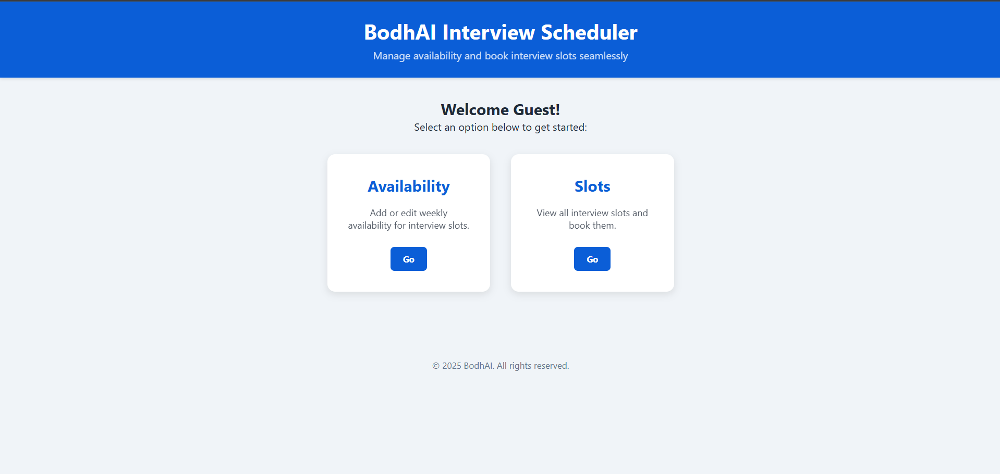
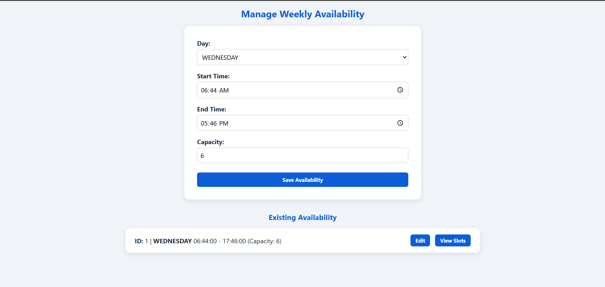

## 📅 Interview Scheduling System

A full-stack Interview Scheduling System that allows interviewers to define weekly availability and enables candidates to view and book interview slots seamlessly.

The system automatically generates interview slots for the upcoming two weeks based on interviewer availability, enforces booking limits, and ensures data consistency using transactional backend logic.

---

## 🚀 Key Features

## 👩‍💼 Interviewer
- Add weekly availability (day, start time, end time, capacity)
- Update availability with automatic slot regeneration
- Prevent invalid time ranges (start time must be before end time)
- Capacity-based interview scheduling

## 👨‍🎓 Candidate
- View available interview slots
- Slots grouped date-wise
- Book only one slot per email
- Prevents overbooking once capacity is full

---

## ⚙️ System Capabilities
- 30-minute interview slots
- Slot generation for next 14 days
- Transaction-safe booking
- Clean REST APIs
- Backend validation + frontend validation

---

## 🛠️ Tech Stack

| Layer | Technology |
|------|-----------|
| Backend | Java, Spring Boot |
| ORM | Spring Data JPA (Hibernate) |
| Database | MySQL |
| Frontend | Node.js, Express, EJS |
| API Style | REST |
| Build Tool | Maven |
| Versioning | Git |

---

## 📂 Project Structure
```
interview-scheduling/
│
├── backend/
│   ├── src/main/java/com/app/interview/
│   │   ├── controller/
│   │   │   └── InterviewController.java
│   │   ├── service/
│   │   │   └── InterviewService.java
│   │   ├── model/
│   │   │   ├── WeeklyAvailability.java
│   │   │   ├── InterviewSlot.java
│   │   │   └── Booking.java
│   │   ├── repository/
│   │   │   ├── WeeklyAvailabilityRepository.java
│   │   │   ├── InterviewSlotRepository.java
│   │   │   └── BookingRepository.java
│   │   ├── exception/
│   │   │   ├── SlotFullException.java
│   │   │   └── GlobalExceptionHandler.java
│   │   └── config/
│   │       └── CorsConfig.java
│   └── src/main/resources/
│       └── application.yml
│
├── frontend/
│   ├── app.js
│   ├── package.json
│   └── views/
│       ├── availability.ejs
│       └── slots.ejs
│
├── database/
│   └── schema.sql
│
├── assets/
│   ├── main.png
│   ├── afteredit.png
│   └── slots.png
│
├── README.md
├── .env
└── .gitignore
```
---

## 🖼️ Application Screenshots

## 🏠 Main Dashboard


## ✏️ Availability After Edit


## 🗓️ Interview Slots View


---

## 🔐 Business Rules Implemented
- Start time must be before end time
- Slots generated only for selected weekday
- Fixed slot duration: 30 minutes
- One booking per candidate email
- Capacity-based booking enforcement
- Slots regenerated safely on availability update

---

## 🔗 API Endpoints

## Availability
GET /api/availability  
POST /api/availability  
PUT /api/availability/{id}

## Slots
GET /api/slots/by-availability/{availabilityId}

## Booking
POST /api/book/{slotId}?email=user@example.com

---

## ⚙️ How to Run Locally

## Backend (Spring Boot)
cd backend  
mvn spring-boot:run  

Backend runs on:  
http://localhost:8080

## Frontend (Node + Express)
cd frontend  
npm install  
npm start  

Frontend runs on:  
http://localhost:3000

## Database Setup
CREATE DATABASE interview_db;

Tables are auto-created by Hibernate  
Optional base schema available in database/schema.sql

---

## 🧠 Design Highlights
- Clean layered architecture (Controller → Service → Repository)
- Proper JPA relationships (@OneToMany, @ManyToOne)
- Transaction management using @Transactional
- Defensive validation at frontend and backend
- Slot regeneration logic avoids duplication
- Race-condition-safe booking

---

## 📌 Future Enhancements
- Delete availability safely
- Weekly interview limit per interviewer
- Role-based access (Interviewer / Candidate)
- Swagger API documentation
- Calendar-based UI
- Email notifications

---

## 👨‍💻 Author
Vivek
GitHub: https://github.com/webdeveloperdesigner

Built as a real-world interview assignment & full-stack backend project.

---

## 📄 License
This project is licensed under the MIT License.
